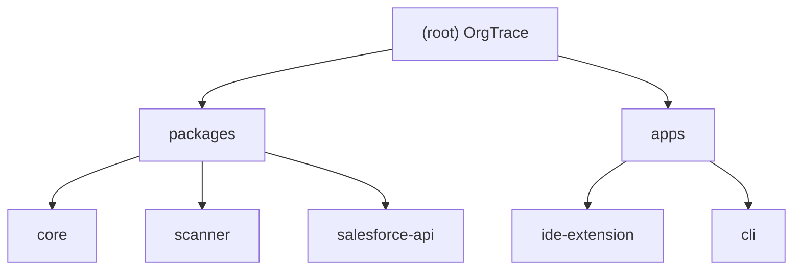

# CLAUDE.md

This file provides guidance to Claude Code (claude.ai/code) when working with code in this repository.

## Build, Lint, Test Commands

```bash
# Install
pnpm install

# Build all packages (Turborepo)
pnpm build

# Type-check all packages
pnpm lint

# Run all tests
pnpm test

# Single package
pnpm --filter @orgtrace/scanner test
pnpm --filter @orgtrace/core test
pnpm --filter orgtrace-ide-companion test

# Watch mode (extension host)
cd apps/ide-extension && node esbuild.js --watch
# Watch mode (webview)
cd apps/ide-extension && pnpm dev:webview

# Package the VS Code extension
cd apps/ide-extension && pnpm package
```

Tests use Vitest. Test files live alongside the code they cover as `*.test.ts`. There are no separate test directories.

---

## Architecture Overview

OrgTrace is a pnpm + Turborepo monorepo. The dependency direction is strictly one-way:

```
apps/* ──► packages/scanner ──► packages/core
apps/* ──► packages/core
apps/* ──► packages/salesforce-api ──► packages/core
```

**Package boundaries are non-negotiable:**
- `packages/core` — pure TypeScript, no Node/browser/vscode imports. Owns `DependencyResult`, `ComponentRef`, `RiskScore`, `RiskEngine`, `MetadataRegistry`.
- `packages/scanner` — Node.js only (uses `fs`, `path`, `fast-glob`). Owns `scan()`, `discoverComponents()`, and all `FileParser` implementations.
- `packages/salesforce-api` — Phase 2 placeholder. Only exports `SalesforceOrgContext` type.
- `apps/ide-extension` — the only place that may import `vscode`. Owns `OrgTraceService`, `WebviewProvider`, commands, and the React webview.
- `apps/cli` — thin shell; uses `@orgtrace/core` and `@orgtrace/scanner`.

---

## Module Structure



| Module | Path | Role |
|--------|------|------|
| `@orgtrace/core` | `packages/core` | Shared types, `RiskEngine`, `MetadataRegistry` |
| `@orgtrace/scanner` | `packages/scanner` | Local SFDX file scanner and parsers |
| `@orgtrace/salesforce-api` | `packages/salesforce-api` | Phase 2 Tooling/Metadata API (placeholder) |
| `orgtrace-ide-companion` | `apps/ide-extension` | VS Code extension + React webview |
| `@orgtrace/cli` | `apps/cli` | CLI entry point (planned) |

---

## Key Patterns and Conventions

### Central data contract
`DependencyResult` (in `packages/core/src/types.ts`) is the single output shape that flows from scanner through service to webview and report export. Do not introduce per-surface variants.

### Activation
The extension activates on `workspaceContains:**/sfdx-project.json`. It scans local SFDX project files only — no Salesforce org connection in Phase 1.

### Scanner flow
1. `discoverComponents(projectPath, query, typeFilter?)` — fast filename-based glob, no file reads for specialized types. Used to populate the picker.
2. `scan(options)` — reads file contents and runs each `FileParser` against every matched file in batches (`DEFAULT_CONCURRENCY = 50`). Respects `.forceignore`.
3. `targetSearchTerm(target)` — for `CustomField` targets with a qualified name (`Object.Field__c`), the search term is the bare field name. This ensures all parsers find the field in metadata that references it without the object prefix.
4. `deduplicateReferences()` — keyed on `source|target|relationship|filePath|lineNumber|matchedText`.

### Parser registry
`fileParsers` in `packages/scanner/src/parsers/index.ts` is the ordered array of `FileParser` implementations. Each parser implements `canParse(filePath)` and `parse(context)`. Adding a new metadata type requires adding a new file here — not modifying other parsers. Current parsers: Apex (`.cls`/`.trigger`), Flow XML, LWC JS, LWC HTML, Object/Field XML, PermissionSet XML, generic `-meta.xml`.

### MetadataRegistry
`registerMetadataType()` in `packages/core/src/MetadataRegistry.ts` is the central registry for supported types. Prefer extending the registry over hardcoding type strings in multiple places.

### Risk scoring
`calculateRisk()` in `packages/core/src/RiskEngine.ts` operates on `RiskRuleInput`. Rules are an array of `{id, match, scoreIncrease, reason, recommendation}`. Score is capped at 100. Levels: Low (<25), Medium (<50), High (<75), Critical (>=75). Inbound references weight higher than outbound dependencies.

### Webview messaging
The typed message contract in `apps/ide-extension/src/messages.ts` defines all postMessage shapes between the extension host and React webview. The webview never runs scanner logic — it sends intents (`analyzeMany`, `exportMarkdown`, `openInEditor`) and renders results.

### WebviewProvider HTML injection
`WebviewProvider.getHtml()` reads the Vite-built `webview/dist/index.html`, rewrites asset URIs to `webview.asWebviewUri()`, and injects `window.__ORGTRACE_INITIAL_RESULT__` and `window.__ORGTRACE_INITIAL_COMPONENTS__` into `<head>` for initial render.

### Cache
`CacheStore` interface with `InMemoryCacheStore` implementation. Cache key is `projectPath:type:apiName`. `OrgTraceService.clearCache()` is called before any rescan.

### Component picker model
`buildComponentPicks(refs)` in `apps/ide-extension/src/commands/componentPicks.ts` produces `ComponentPickModel[]` (separators + items) in `GROUP_ORDER` priority (automation/code first, then fields, then everything else). `buildScopeOptions()` derives the metadata-type filter from the same `GROUP_ORDER`.

### TypeScript config
`tsconfig.base.json` enables `strict`, `exactOptionalPropertyTypes`, `noUncheckedIndexedAccess`, `noImplicitReturns`, `noFallthroughCasesInSwitch`. Do not weaken these flags.

### Build tooling
- Library packages (`core`, `scanner`, `salesforce-api`) use `tsup` to produce both CJS and ESM outputs.
- The extension host bundle uses `esbuild` (CJS, Node 18 target) with `vscode` externalized.
- The webview uses Vite + `@vitejs/plugin-react`.

---

## Testing Strategy

- All test frameworks use Vitest (`vitest run --passWithNoTests`).
- Integration tests for `scan()` and `discoverComponents()` create real temp directories (`os.tmpdir()`), write fixture files, and clean up with `afterAll`.
- Unit tests for `buildComponentPicks`, `buildScopeOptions`, `generateImpactMarkdown`, `parseSearchTerms` use pure in-memory data.
- `Scanner.fieldMatch.test.ts` specifically verifies that object-qualified field names (`Case.Field__c`) resolve via the bare field name search term.
- No mocking of `fs` — tests use real filesystem fixtures.
- Run a single test file: `pnpm --filter @orgtrace/scanner exec vitest run src/Scanner.fieldMatch.test.ts`

---

## AI Usage Guidelines

- Do not rename public contracts: `DependencyResult`, `ComponentRef`, `RiskScore`, `scan`, `discoverComponents`, `calculateRisk`, command IDs.
- Do not move logic across package boundaries without a clear reason.
- Parser logic stays in `packages/scanner/src/parsers/`. Risk scoring stays in `packages/core`. UI logic stays in `apps/ide-extension`.
- Do not add Salesforce API calls, AI calls, SQLite, or cloud backend in Phase 1.
- When fixing a parser or risk bug, change only the smallest responsible module and add a test.
- Prefer extending `MetadataRegistry` and `fileParsers` over hardcoding type strings.
- `apps/browser-extension` is a Phase 1B placeholder — do not implement.

---

## Changelog

| Date | Description |
|------|-------------|
| 2026-06-09 | Initial CLAUDE.md generated by architect scan |
